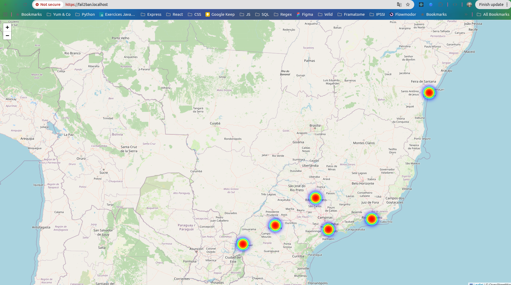

# Fail2ban Security Map

> - **DEMURE Aurélie** Développeuse Full Stack /DevOps

---

## 1. Présentation du Projet

Ce projet s'inscrit dans une démarche :

- de **conteneurisation** (Docker),
- d'**orchestration** (Kubernetes),
- et de **mise à disposition sécurisée** via Cloudflare Zero Trust.

Pour ce projet j'ai choisi de travailler avec Fail2ban, un outil utilisé pour détecter des tentatives d’attaque (par exemple des connexions SSH échouées) et bannir les adresses IP malveillantes. Le projet a pour objectif de **collecter et analyser en direct des adresses IP bannies**, puis de les **visualiser via une interface web** sur une heat map géographique interactive.

**Fonctionnalités principales :**

- Collecte des IP bannies par Fail2ban
- Envoi des IP vers une base de données PostgreSQL
- Géolocalisation des IP (GeoIP)
- Exposition des bannissements par une API backend
- Affichage des IP sur une carte interactive dans une interface web

**Screenshot de l'application déployée :**

---

## 2. Architecture Technique

L'architecture repose sur les principes suivants :

- **Cloudflare Tunnel (Zero Trust)** pour exposer l'application sans ouvrir de ports entrants
- **Caddy** comme reverse proxy (séparation public/privé)
- **Backend API (Node.js)** pour centraliser les bannissements
- **Base de données PostgreSQL** pour persister les IP
- **Frontend web (React)** pour la visualisation
- **Fail2ban** réel ou simulé selon la version

### Schéma d'infrastructure

_Ce schéma est généré dynamiquement à partir du fichier `architecture.puml` présent dans ce dépôt._

---

## 3. Organisation du dépôt

Ce dépôt contient **plusieurs versions du même projet**, correspondant à différentes approches techniques et à une progression pédagogique :

- `docker/` : version Docker Compose fonctionnelle
- `kubernetes-v1/` : première tentative Kubernetes simple (Fail2ban réel)
- `kubernetes-v2/` : version Kubernetes avec simulation de Fail2ban et load balancing

---

## 4. Démarrage du projet

Ce README global ne décrit pas les commandes de lancement.

Chaque version dispose de son propre README :

- [docker](docker/README.md)
- [kubernetes-v1](kubernetes-v1/README.md)
- [kubernetes-v2](kubernetes-v2/README.md)

---

## 5. Méthodologie et Transparence IA

### Organisation

Le projet a été réalisé de manière incrémentale :

- mise en place de l’infrastructure Docker,

- intégration de Fail2ban,

- synchronisation des données vers la base,

- développement du backend,

- développement du frontend,

- sécurisation et exposition via proxy et tunnel.

### Utilisation de l'IA

**Outils utilisés :** ChatGPT

- _Génération de code :_ J'ai utilisé ChatGPT notammement pour m'aider à générer le script générateur d'adresses IP.
- _Débuggage :_ ChatGPT m'a aidé à comprendre les différentes erreurs rencontrées lors du développement de l'application.
- _Documentation :_ ChatGPT m'a aidé à comprendre et aller plus loin sur les concepts et les technologies utilisées dans ce projet notamment afin de clarifier les rôles de chaque service (Cloudflare, zero trust, Caddy privé, Caddy public...)

- **Apprentissage :**
  L'IA a servi de support dans l'analyse des différentes erreurs rencontrées tout au long du développement. J'ai beaucoup appris sur le fonctionnement de la communication inter-conteneurs, et j'ai pu m'approprier plus rapidement les différentes technologies utilisées.

---

## 6. Bilan du projet

Ce projet m’a permis de découvrir le modèle de sécurité **Zero Trust** et la protection offerte par **Fail2ban**. J'ai envie d'aller plus loin sur ces sujets et je projette d'implémenter **Cloudflare** et **Fail2ban** sur mon propre serveur afin d'en améliorer la sécurité.
Je connaissais déjà Docker et ce projet m'a permis de mieux comprendre le fonctionnement de Kubernetes, en particulier le rôle des Pods, des Deployments et des Services, ainsi que la manière dont Kubernetes gère la scalabilité et la répartition des requêtes par rapport à une approche Docker Compose.

## Licence

Ce projet est distribué sous licence **MIT**.
