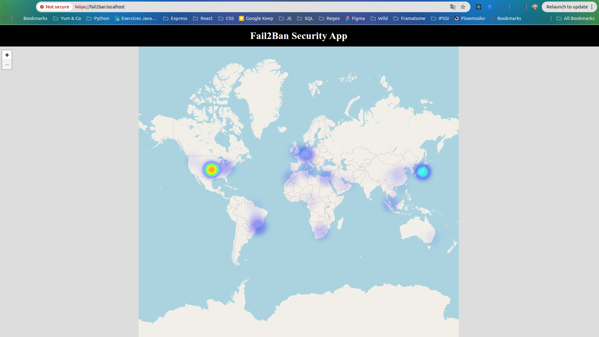
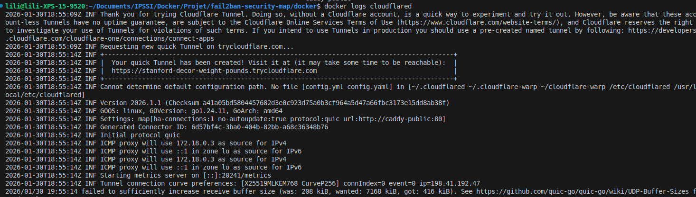
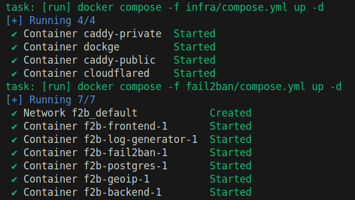
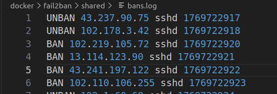
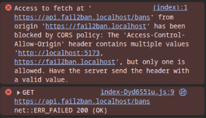

# Fail2ban Security Map - Version Docker Compose – Stack fonctionnelle

Cette version du projet repose sur **Docker Compose** et constitue la version **fonctionnelle de référence.**
Elle intègre un **Fail2ban réel**, un backend API, un frontend web et une base de données PostgreSQL, exposés de manière sécurisée via **Caddy** et **Cloudflare Tunnel.**

## 1. Description des services

| Service           | Image Docker                 | Rôle                        | Port Interne |
| :---------------- | :--------------------------- | :-------------------------- | :----------- |
| **Caddy Public**  | `caddy-public`               | Reverse Proxy public        | 80           |
| **Caddy Private** | `caddy-private`              | Reverse Proxy interne       | 80           |
| **Frontend**      | `f2b-frontend`               | Application web (map + UI)  | 80           |
| **Backend**       | `f2b-backend`                | API REST                    | 3000         |
| **GeoIP**         | `maxmindinc/geoipupdate`     | Mise à jour base GeoIP      | N/A          |
| **Log Generator** | `f2b-log-generator`          | Simulation d'attaques       | N/A          |
| **Fail2ban**      | `linuxserver/fail2ban:1.1.0` | Détection & bannissement IP | N/A          |
| **DB**            | `postgres:15`                | Stockage des bannissements  | 5432         |
| **Tunnel**        | `cloudflare/cloudflared`     | Exposition Internet         | N/A          |

---

## 2. Guide d'installation

### Prérequis

- Docker
- Docker Compose
- Taskfile

### Pour lancer le projet localement :

1.  Cloner le dépôt :

    ```bash
    git clone [https://github.com/lilipix/fail2ban-security-map.git](https://github.com/lilipix/fail2ban-security-map.git)

    cd fail2ban-security-map
    ```

2.  Configuration Fail2ban (fichiers non versionnés) :

Pour des raisons de lisibilité et de volume, le dossier `fail2ban-config/` n’est pas versionné.

Des fichiers d’exemple sont fournis dans le dossier `fail2ban/samples/` :

- `jail.local.sample` → à copier vers `fail2ban/fail2ban-config/fail2ban/jail.local`
- `log2file.conf.sample` → à copier vers `fail2ban/fail2ban-config/fail2ban/action.d/log2file.conf`

Ces fichiers décrivent la configuration Fail2ban utilisée pour la démonstration (jail personnalisée et action d’écriture dans un volume partagé).

2.  Lancer la stack :

    ```bash
    cd docker

    task up
    ```

    La commande **task up** démarre l'ensemble des services.

3.  Accéder aux services en local :

> Lors du premier démarrage, l’API doit être accessible pour que le reverse proxy puisse établir correctement les connexions HTTPS.

    - API : `https://api.fail2ban.localhost/bans`
    - Frontend : `https://fail2ban.localhost`



4.  Obtenir l'URL publique :

    ```bash
    docker compose logs cloudflared
    ```



### Outils et automatisation

**Taskfile**
Les versions utilisent un **Taskfile** afin de simplifier les commandes récurrentes Docker (démarrage, arrêt, construction, ...)

**Dockge**
Le projet peut également être administré via **Dockge**, une interface web permettant de :

- gérer les stacks Docker Compose,
- visualiser l'état des services,
- consulter les logs.



---

## 3. Focus Fail2ban

Fail2ban étant un outil système, il ne communique pas directement avec une base de données. Il a donc fallu concevoir une architecture intermédiaire.
Pour simuler des attaques, Fail2ban surveille un fichier de logs simulant des tentatives SSH échouées. Ces logs sont générés par un script pour reproduire un comportement réaliste d'attaque. Pour faciliter la démonstration du fonctionnement de Fail2ban le nombre d'adresses IP générée est en grande quantité et en mode burst.

Fail2ban est configuré via une jail basée sur les filtres standards fournis par Fail2ban. La jail permet de définir le nombre maximal de tentatives autorisées, la durée d'observation, la durée du bannissement et le fichier de log à surveiller. Fail2ban détecte alors automatiquement les adresses IP dépassant le seuil autorisé et déclenche un bannissement.

Afin de communiquer avec le backend, Fail2ban écrit les logs dans un fichier texte shared/bans.log partagé avec le backend. Ce fichier est stocké dans un **volume Docker partagé.**
Ce volume est monté dans le conteneur fail2ban en écriture et dans le conteneur backend en lecture.



---

## 4. Difficultés rencontrées et solutions

- **Image GeoIP**  
  Problèmes rencontrés avec une image geoip choisie initialement car elle semblait fournir un service GeoIP sans dépendance à une API externe, et parce qu'elle était la première référencée sur DockerHub et avec la mise à jour la plus récente. L'image s'est révélée peu documentée, difficile à intégrer, et source de complexité. Pour comprendre le dysfonctionnement, j'ai analysé les logs du conteneur, j'ai effectué des tests réseau avec wget et curl, j'ai regardé le code source, et j'ai finalement choisi une autre image en utilisant une base GeoIP officielle.

- **Réseaux Docker et reverse proxy**  
  L'utilisation de plusieurs fichiers `docker-compose.yml` avec des réseaux externes a entraîné des problèmes de résolution DNS entre services, j'ai d'abord configuré le Caddy privé en HTTP, puis certaines erreurs ont conduit à une configuration en HTTPS, rendue possible par la gestion automatique des certificats SSL par Caddy.

- **IP invalides**
  Certaines adresses IP générées par le script de simulation étaient invalides ou non géolocalisabes et faisaient échouer l'endpoint `/bans`. J'ai mis en place un mécanisme de gestion d’erreur (`try/catch`) afin qu’une IP défaillante n’empêche plus le traitement de l’ensemble de la requête.

- **CORS**
  Problèmes d'erreurs CORS lors des appels depuis le frontend vers l'API, les services n'étant pas exposés sur les mêmes ports, le navigateur bloquait systématiquement les requêtes malgré l'ajout des en-têtes CORS côté API Express. La gestion des CORS dans Caddy et dans l'API envoyait plusieurs valeurs pour Access-Control-Allow-Origin, ce qui est interdit par la spécification CORS. L'erreur a pu être solutionnée en centralisant la gestion des CORS dans le header du reverse proxy Caddy privé.

  

- **Fail2ban et permissions**  
  Difficultés pour l'utilisation de Fail2ban, nécessité d'ajouter une jail personnalisée pour la captation des logs, et d'ajouter un fichier d'écriture afin de récupérer les adresses IP bannies et de les partager avec le backend ce qui a introduit des problèmes de permissions et d'accès aux fichiers, pour cela j'ai dû utiliser des volumes Docker partagés, j'ai dû prendre en compte l'ordre de démarrage des services et j'ai dû unifier les UID/GID des 2 conteneurs.

- **Disponibilité de l’API et certificats HTTPS**  
  Lors du premier accès au frontend, une erreur de certificat apparaît si l’API n’est pas encore disponible.  
  Ce comportement est lié au fonctionnement du reverse proxy Caddy en HTTPS, qui nécessite que les services backend soient joignables pour établir correctement les connexions sécurisées.
  Le problème a été identifié comme une dépendance temporelle entre le démarrage des services.

- **Cloudflare**  
  Des erreurs 502 lors de connexion avec Cloudflare qui étaient liée à un blocage du côté de Cloudflare pour cause de trop nombreuses requêtes.

- **Débogage général**  
  D'autres difficultés ont été rencontrées (types SQL, erreurs de code, problèmes d’URL entre frontend et backend) résolues à l’aide des logs des conteneurs Docker, de `console.log`, et des outils de développement du navigateur.
