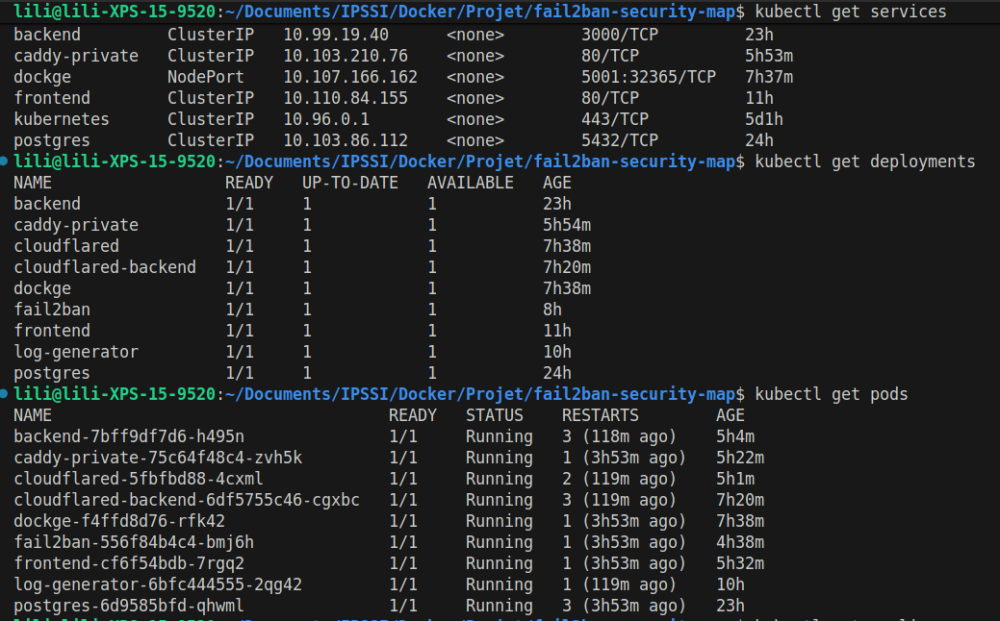

# Fail2ban Security Map – Kubernetes V1

Cette version correspond à une **première tentative de déploiement Kubernetes** du projet Fail2ban Security Map.
Elle a pour objectif principal de **découvrir Kubernetes**, ses concepts fondamentaux et ses contraintes, en partant d’une stack initialement fonctionnelle sous Docker Compose.

Cette version **n’est pas pleinement fonctionnelle concernant Fail2ban** et doit être considérée comme une **étape d’apprentissage**.

---

## 1. Objectifs de cette version

- Découvrir les concepts de base de Kubernetes :
  - Pods
  - Deployments
  - Services
- Comprendre les différences entre Docker Compose et Kubernetes
- Tenter l’intégration d’un **Fail2ban réel** dans un environnement Kubernetes
- Identifier les limites de cette approche dans un contexte pédagogique

---

## 2. Architecture (vue générale)

Dans cette version, l’architecture reste proche de celle utilisée avec Docker :

- Frontend web
- Backend API
- Base de données PostgreSQL
- Fail2ban réel
- Reverse proxy
- Exposition via Cloudflare Tunnel

Cependant, la transposition directe de cette architecture vers Kubernetes s’est révélée **complexe**.

---

## 3. Déploiement Kubernetes

Les composants sont déployés sous forme de :

- **Deployments** pour les services applicatifs
- **Services Kubernetes** pour l’exposition interne
- **Volumes** pour la persistance des données et des logs

---

## 4. Volumes persistants et configuration

### PersistentVolumeClaims (PVC)

L’application utilise des PersistentVolumeClaims afin d’assurer la persistance des données indépendamment du cycle de vie des pods.

Les PVC sont utilisés pour :

- la base de données PostgreSQL

- les logs applicatifs

- les données partagées entre services

- les données de Dockge

Les données restent disponibles même en cas de redémarrage ou de recréation des pods.

### ConfigMaps

J'ai utilise des ConfigMaps pour externaliser certaines configurations (reverse proxy), permettant de modifier le comportement des services sans reconstruire les images Docker.

## 5. Lancement de la version Kubernetes V1

Cette version a été testée localement à l’aide de **Minikube**.

### Prérequis

- Docker
- kubectl
- Minikube

### Démarrage du cluster

```bash
minikube start
```

### Utiliser le moteur Docker de Minikube

```bash
cd kubernetes-v1
eval $(minikube docker-env)
```

### Construire les images

```bash
docker build -t backend:latest ./fail2ban/backend
docker build -t frontend:latest ./fail2ban/frontend
docker build -t log-generator:latest ./fail2ban/log-generator

```

### Déploiement des ressources

```bash
kubectl apply -f kubernetes/
```

### Vérification des ressources

```bash
kubectl get deployments
kubectl get pods
kubectl get services
```

**Visualisation des ressources :**




### Accès à l'application

```bash
kubectl logs cloudflared
```

## 6. Problèmes rencontrés

Cette version met en évidence plusieurs difficultés importantes :

### Intégration de Fail2ban

Fail2ban est un outil système conçu pour fonctionner :

- avec des logs système réels
- avec un accès direct au firewall (iptables / nftables)

Dans un environnement Kubernetes :

- les logs applicatifs sont répartis entre plusieurs pods
- l’accès au firewall du nœud n'est pas directement disponible
- la notion de conteneur éphémère complique l’usage de Fail2ban
- la logique de bannissement système n'a plus de sens au niveau du pod

L’intégration d’un Fail2ban réel dans Kubernetes s’est donc révélée **non adaptée** à ce stade.

La logique de détection et de bannissement sera déplacée dans l'application backend sur une V2.

---

### Gestion des volumes et des logs

La gestion des volumes partagés (logs Fail2ban → backend) est plus complexe que sous Docker Compose :

- multiplicité des pods
- contraintes de montage
- difficulté à garantir la cohérence des données

---

### Gestion de GeoIP

L’enrichissement géographique des adresses IP reposait initialement sur une image dédiée GeoIP et un fichier GeoLite2 partagé via un volume (PVC). Il est apparu que je ne pouvais pas utiliser ces données via le PVC pour des problèmes de droits, et le stockage du fichier dans un configMaps n'a pu être possible car le fichier était trop volumineux. J'ai embarqué directement le fichier GeoIp dans l'image du backend.

---

### Complexité globale

Cette version a permis de constater que :

- Kubernetes n’est pas une simple transposition de Docker Compose
- certains outils doivent être repensés pour être “cloud-native”

---

## 7. Bilan Kubernetes V1

Cette première version Kubernetes a été **volontairement conservée** dans le dépôt afin de documenter :

- les limites rencontrées
- les erreurs de conception initiales
- la montée en compétence progressive sur Kubernetes

Elle a servi de base de réflexion pour la version suivante, plus adaptée aux contraintes Kubernetes.

Pour une version Kubernetes fonctionnelle et plus cohérente, se référer à **kubernetes-v2**.
