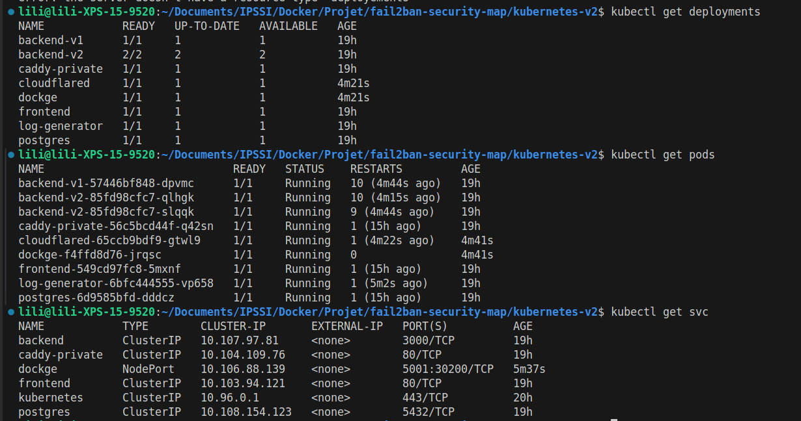
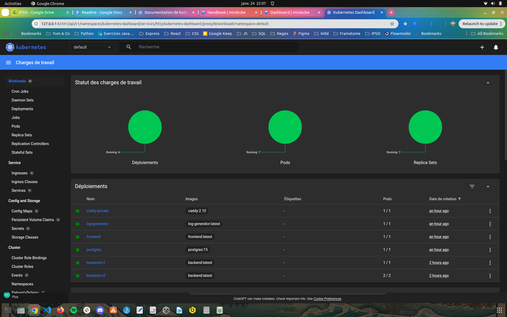
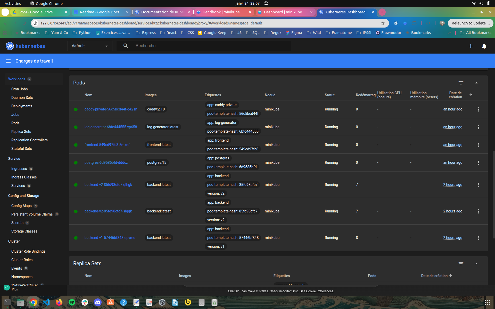
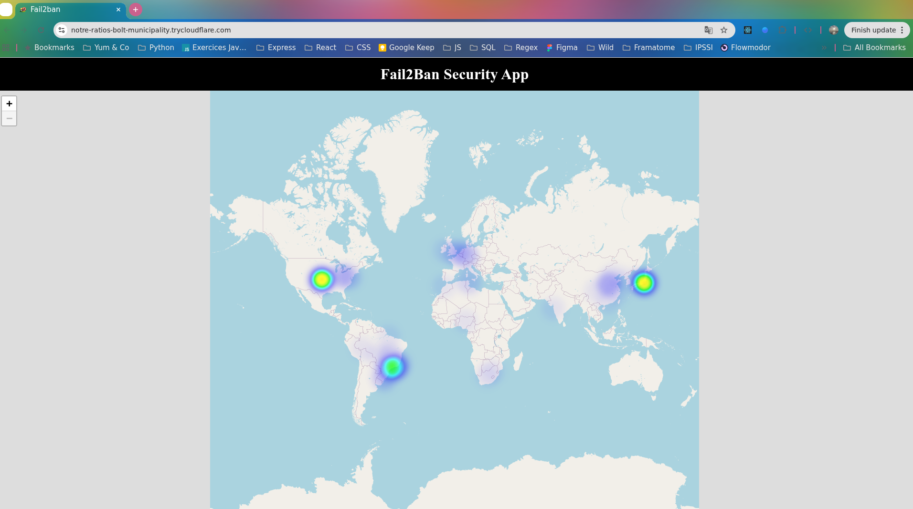
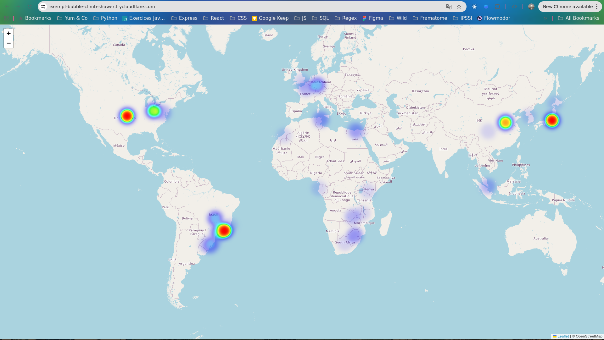

# Fail2ban Security Map – Kubernetes V2

Cette version correspond à une **évolution de la version Kubernetes V1**. Elle peut servir de référence pour voir l'application déployée.
Elle vise à proposer une architecture **plus cohérente avec les principes Kubernetes**, tout en restant adaptée à un contexte pédagogique.

Contrairement à la version V1, cette itération met en évidence :

- la gestion de plusieurs **Deployments**
- l’utilisation des **Services Kubernetes** pour exposer les applications
- la **répartition des requêtes** entre plusieurs pods backend

Fail2ban n’est plus utilisé comme outil système réel dans cette version.  
Son comportement est **simulé** afin de s’adapter aux contraintes d’un environnement Kubernetes.

---

## 1. Objectifs de cette version

Les objectifs principaux de Kubernetes V2 sont :

- Adapter l’architecture aux contraintes Kubernetes
- Mettre en place plusieurs instances du backend
- Illustrer le **load balancing interne** fourni par Kubernetes
- Séparer clairement les rôles des composants (frontend, backend, base de données)

---

## 2. Architecture retenue

L’architecture Kubernetes V2 repose sur les éléments suivants :

- **Frontend**
  - Déployé via un Deployment
  - Exposé par un Service Kubernetes de type `ClusterIP`

- **Backend**
  - Déployé via **deux Deployments distincts** (`backend-v1` et `backend-v2`)
  - Plusieurs pods backend sont donc actifs simultanément
  - Exposé par un **Service Kubernetes unique**

- **Base de données PostgreSQL**
  - Déployé via un Deployment
  - Accessible par le backend via un Service interne
  - Données persistées à l’aide d’un PersistentVolumeClaim
  - Configuration fournie via des Secrets Kubernetes

Les Services Kubernetes assurent la communication entre les composants et la distribution des requêtes vers les pods disponibles.

---

## 3. Répartition de charge (Load Balancing)

Dans cette version, le **load balancing est assuré nativement par Kubernetes**.

Le Service `backend` :

- sélectionne tous les pods portant le label `app: backend`
- répartit automatiquement les requêtes entrantes entre les différentes instances backend

Cette répartition est :

- **interne au cluster**
- de niveau réseau (Layer 4)
- gérée par Kubernetes sans configuration supplémentaire

---

## 4. Simulation de Fail2ban

Fail2ban étant un outil système peu adapté à Kubernetes (logs distribués, conteneurs éphémères, absence d’accès direct au firewall), son fonctionnement est **simulé** dans cette version.

La simulation permet de :

- conserver la logique de détection et de bannissement
- injecter des adresses IP malveillantes dans le pipeline backend
- alimenter la visualisation côté frontend

Cette approche permet de démontrer le fonctionnement global de l’application sans dépendre de mécanismes système incompatibles avec Kubernetes.

---

## 5. Volumes persistants et configuration

### PersistentVolumeClaims (PVC)

L’application utilise des PersistentVolumeClaims afin d’assurer la persistance des données indépendamment du cycle de vie des pods.

Les PVC sont utilisés pour :

- la base de données PostgreSQL

- les logs applicatifs

- les données partagées entre services

- les données de Dockge

Les données restent disponibles même en cas de redémarrage ou de recréation des pods.

### ConfigMaps

J'ai utilise des ConfigMaps pour externaliser certaines configurations (reverse proxy), permettant de modifier le comportement des services sans reconstruire les images Docker.

---

## 6. Lancement de la version Kubernetes V2

Cette version a été testée localement à l’aide de **Minikube**.

### Prérequis

- Docker
- kubectl
- Minikube

### Démarrage du cluster

```bash
minikube start
```

### Utiliser le moteur Docker de Minikube

```bash
cd kubernetes-v2
eval $(minikube docker-env)
```

### Construire les images

```bash
docker build -t backend:latest ./fail2ban/backend
docker build -t frontend:latest ./fail2ban/frontend
docker build -t log-generator:latest ./fail2ban/log-generator

```

### Déploiement des ressources

```bash
kubectl apply -f kubernetes/
```

### Vérification des ressources

```bash
kubectl get deployments
kubectl get pods
kubectl get services
```

**Visualisation des ressources (2 déploiements backend et différentes instances) :**







### Accès à l'application

```bash

kubectl logs <nom-pod-cloudflare>
```





---

## 7. Différences avec la version 1

| Kubernetes V1                            | Kubernetes V2                         |
| ---------------------------------------- | ------------------------------------- |
| Tentative d’intégration de Fail2ban réel | Fail2ban simulé                       |
| 1 instance backend                       | Plusieurs pods backend                |
| Pas de répartition de charge             | Load balancing via Service Kubernetes |

---
